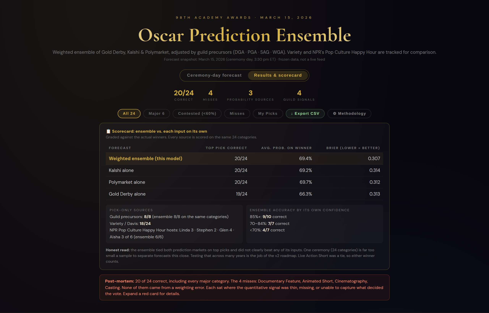
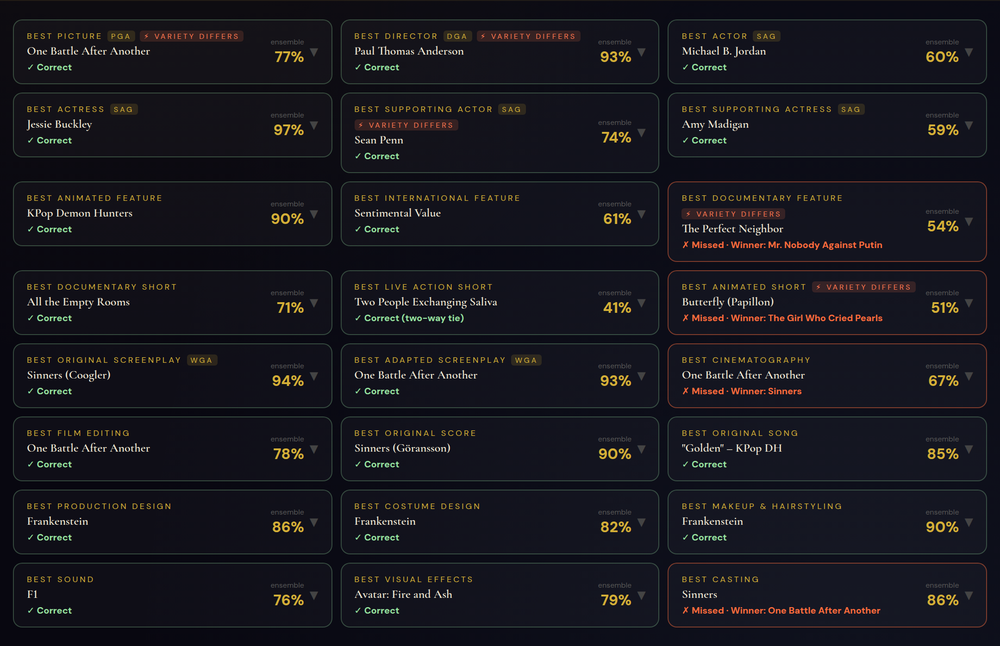
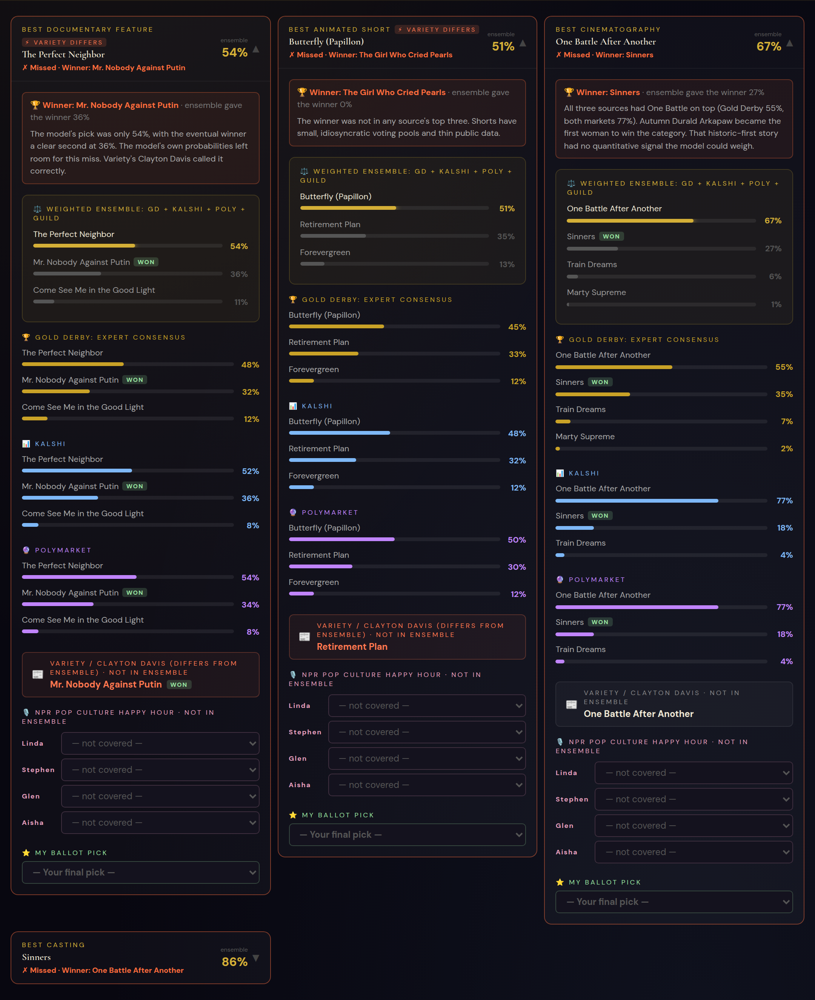
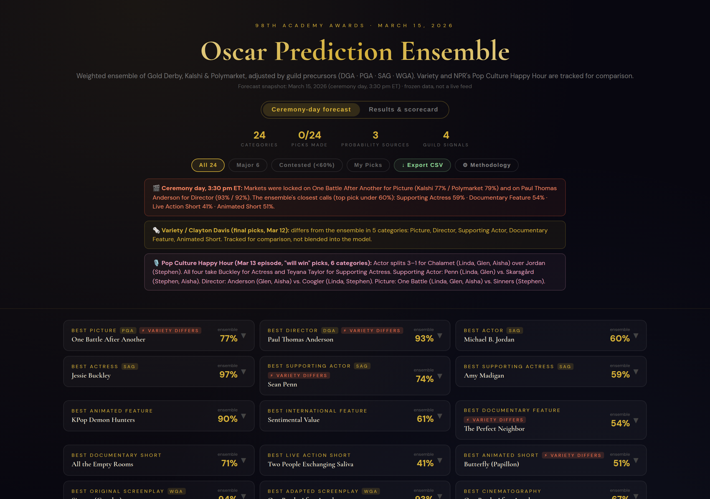
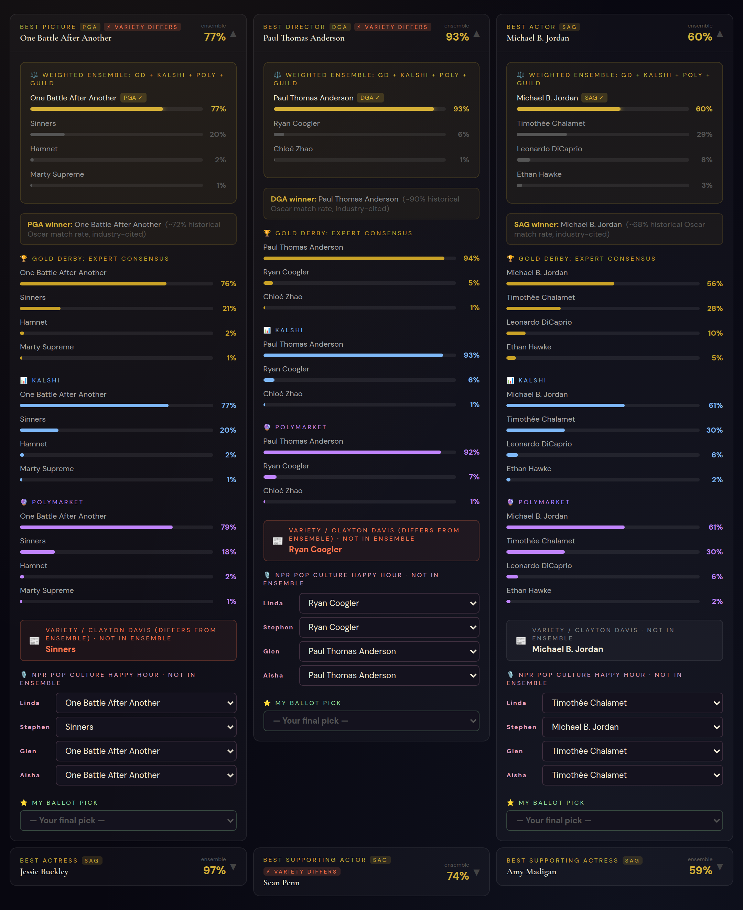
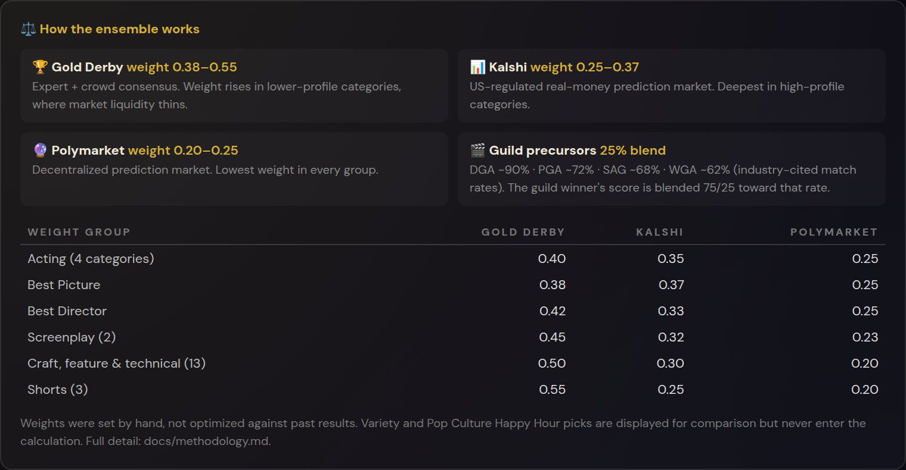
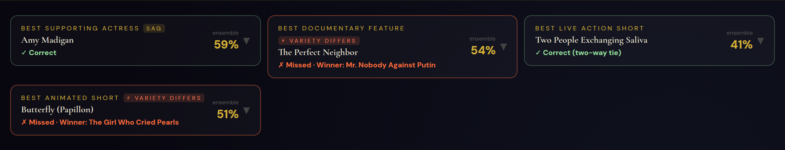

# Oscar Prediction Ensemble — 98th Academy Awards (2026)

I built a forecasting model that predicts Academy Award winners by blending
several imperfect sources into one probability per nominee. It combines an
expert-consensus aggregator (Gold Derby), two real-money prediction markets
(Kalshi and Polymarket), and adjustments from the industry guild awards that
precede the Oscars. I ran it live through the 2026 awards season, froze the
forecast on ceremony day, and graded it against the actual winners.

The Oscars are the test case, not the point. The underlying problem comes up in
any business that forecasts: **you have several signals, each with a different
track record, and they partly repeat one another. How do you combine them, and
how do you know the combination helps?** This repo is the first, single-cycle
answer to that question. The [roadmap](docs/roadmap.md) is the multi-year test.

## Headline result

| Metric | Value |
|---|---|
| Categories called correctly | **20 / 24 (83%)** |
| Major categories (Picture, Director, 4 acting, 2 screenplay) | **8 / 8** |
| Brier score, ensemble (lower is better) | **0.307** |
| Best single input, same measure | 0.312 (Polymarket) |
| Top-pick accuracy of best single inputs | 20 / 24 (Kalshi, Polymarket), 19 / 24 (Gold Derby) |

**Bottom line:** the ensemble matched the prediction markets, the toughest
available benchmark — real money, priced by thousands of participants who had
already absorbed the guild results. It tied Kalshi and Polymarket on top picks,
edged all three inputs on Brier score, and fell between them on the probability
it gave eventual winners. Those margins are too small to call a win with 24
outcomes: equal weights, or no guild adjustment at all, would have picked the
same 20 winners. I report that plainly because it's the most useful finding
here, and it's exactly what the v2 back-test is designed to resolve. Full
scorecard: [`docs/results.md`](docs/results.md).

## Screenshots


*Results view. The scorecard grades the ensemble and each of its inputs on the same 24 categories, and the numbers are computed live from the data in the app. It also shows pick-only sources (guilds, Variety, NPR hosts) and accuracy by the model's own confidence level.*


*Every category graded: the ensemble's pick and probability, the guild signal used, and flags where Variety's editorial pick differed from the model. Live Action Short was a two-way tie.*


*The misses, expanded. Each card shows the actual winner, the probability the model gave it, a one-line post-mortem, and every source's numbers with the winner tagged.*


*The forecast exactly as it stood at 3:30 pm ET on ceremony day. Notes summarize the closest calls and where tracked-but-excluded voices disagreed with the model.*


*Source-level detail. Each card shows the ensemble, the guild precursor, Gold Derby, Kalshi, Polymarket, Variety, and the four NPR hosts, plus a personal ballot picker.*


*The in-app methodology panel: what each source is, the full weight table by category group, and how the guild adjustment works.*


*The "Contested" filter shows categories where the model's top pick was under 60%. Two of these four were misses. The other two misses were picks at 67% (Cinematography) and 86% (Casting).*

## What makes this project worth a look

- **It benchmarks itself against simpler alternatives.** A blended model is only
  worth its complexity if it beats simply following its best input. The
  scorecard runs that comparison openly, and the answer (a tie) is reported,
  not buried.
- **It separates "mistuned" from "unknowable."** Three of the four misses had no
  signal in any source: a historic first in Cinematography, a brand-new Casting
  category, and a short film outside every source's top three. In all four
  misses, every source had the same wrong pick on top, so no reweighting could
  have saved them. That distinction drives what v2 fixes and what it doesn't.
- **It documents its own errors, with before-and-after numbers.** Before
  publishing, I re-derived every figure and checked every precursor input
  against the guilds' own announcements. That turned up a wrong WGA winner and a
  name-matching bug that silently dropped a signal. It also corrected several
  claims in my first write-up. All are logged in
  [`docs/decisions.md`](docs/decisions.md). None changed a pick.
- **Source selection was a decision, not a default.** Critic scores and audience
  ratings were tested and rejected. Variety's editorial picks and NPR's Pop
  Culture Happy Hour were tracked but deliberately kept out of the math.
  Post-deadline market swings were treated as noise, not information.
- **It leads to a larger project.** The 2026 weights were hand-set from borrowed
  accuracy figures. The next stage builds a self-owned historical dataset
  (schema in [`docs/historical-dataset-schema.md`](docs/historical-dataset-schema.md))
  to replace those figures with computed ones and to test the weights out of
  sample.

## How the model works

For each category:

1. Weight-average the three sources' probabilities. Gold Derby's weight is
   0.38–0.55, Kalshi's 0.25–0.37, and Polymarket's 0.20–0.25. Gold Derby's share
   rises in lower-profile categories, where market liquidity thins out.
2. For the eight categories with a matching guild award (DGA, PGA, SAG, WGA),
   blend the guild winner's score 25% toward that guild's historical match rate.
3. Renormalize to 100% and pick the top nominee.

Two caveats matter. The weights were set by judgment rather than fitted to
history. The accuracy figures behind them (e.g., "DGA predicts Best Director ~90%
of the time") are industry-cited, not self-computed. Details, formulas, and
known weaknesses are in [`docs/methodology.md`](docs/methodology.md).

## Current scope & roadmap to the 2027 Oscars

**This repo, as it stands:** a complete, single-cycle model, built and run live
for the 2026 season and graded afterward. It stands on its own and doesn't
depend on the historical dataset below.

**What it can't tell you yet:** whether its weights or its guild adjustment help
over many years. One ceremony can't separate forecasts this close. The 2026 data
does offer one concrete hint. By ceremony day the guild adjustment moved no
category by more than a point, because the markets had already priced in the
guild results.

**The plan** ([full roadmap](docs/roadmap.md)):

| Stage | Deliverable | Status |
|---|---|---|
| 1. Historical precursor dataset | Self-owned record of Oscar and guild winners with per-row sources. First pass: DGA, PGA, SAG, WGA for 2015–2025 eligibility years, replacing the borrowed match rates. Second pass: BAFTA, Critics Choice, Golden Globes, back to 2000. | In progress (manual transcription) |
| 2. Forecast archive | Past Gold Derby and market odds where recoverable, plus fixed-point snapshots captured through the 2027 season | Planned |
| 3. Analysis | Four questions, each out of sample: which sources carry independent signal; whether optimized weights beat hand-set and equal weights; whether weights should vary by category; which categories are predictably hard | Planned |
| 4. 2027 model | The dashboard rebuilt on validated weights, flagging new and low-signal categories, frozen before the ceremony and graded with the same scorecard | Planned |

## Repository layout

```
.
├── README.md                          ← you are here
├── LICENSE
├── index.html
├── package.json
├── vite.config.js
├── src/
│   ├── main.jsx                       ← React entry point
│   └── oscars2026.jsx                 ← the model, data snapshot, and app (single file)
├── docs/
│   ├── methodology.md                 ← how the ensemble works, and its weaknesses
│   ├── results.md                     ← full scorecard, baselines, all 24 categories
│   ├── decisions.md                   ← build log, lessons, and review corrections
│   ├── roadmap.md                     ← v2 plan: research questions and stages
│   └── historical-dataset-schema.md   ← design of the self-owned awards dataset
└── screenshots/                       ← app screenshots referenced above
```

## Running it locally

This is a Vite + React project.

```bash
npm install
npm run dev      # starts a local dev server
npm run build    # builds a production bundle to dist/
```

The app opens on the results view. Toggle to **Ceremony-day forecast** to see the
model as it stood before the winners were known. **Export CSV** downloads every
category with each source's pick, the actual winner, and any ballot picks you
entered.

Optional URL parameters reproduce the screenshots above, e.g.
`?view=results&filter=misses&open=best_cinematography`. Available parameters:

- `view`: `forecast` or `results`
- `filter`: `major`, `contested`, or `misses`
- `open`: a comma-separated list of category IDs
- `method=1`: opens the methodology panel

## How this was built: AI-assisted workflow

I used Claude as an implementation partner throughout: to research sources,
assemble data, write and revise the dashboard code, and pressure-test my
reasoning. I set the approach, chose and vetted every source, decided the
weighting logic and what to exclude, caught input errors, and made the calls on
how to interpret the results. That includes going back to the primary podcast
transcript and, in review, to the guilds' own announcements. The judgment calls
are written up in [`docs/decisions.md`](docs/decisions.md) because the
reasoning, not the typing, is what this project is meant to show.

## A note on scope

This is an independent portfolio project about building and candidly evaluating
a forecast from multiple sources. It is **not** a betting tool and makes no claim
to beat prediction markets. Market and expert probabilities are a frozen
ceremony-day snapshot entered by hand. Winners were verified against published
results ([PBS NewsHour](https://www.pbs.org/newshour/arts/heres-a-full-list-of-2026-academy-awards-winners),
[Al Jazeera](https://www.aljazeera.com/news/2026/3/16/oscars-2026-full-list-of-winners)).
